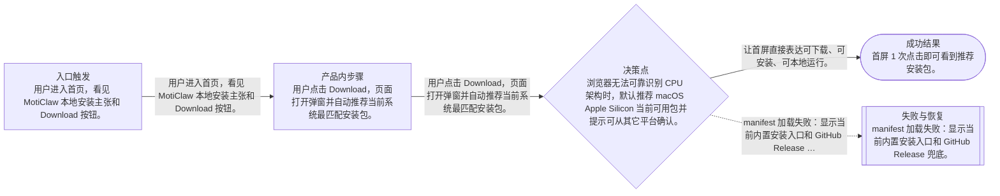

# 流程

## 主流程

- 用户进入首页，看见 MotiClaw 本地安装主张和 Download 按钮。
- 用户点击 Download，页面打开弹窗并自动推荐当前系统最匹配安装包。
- 用户点击推荐包下载；若平台暂未支持，则选择一键安装命令、GitHub Release 或等待对应平台开放。
- 用户关闭弹窗后仍留在首页，可继续查看能力和联系入口。

## Mermaid 流程图

## 边界情况

- 浏览器无法可靠识别 CPU 架构时，默认推荐 macOS Apple Silicon 当前可用包并提示可从其它平台确认。
- manifest 中只有一个可用 artifact 时，不展示可点击的空平台下载。
- 下载链接缺失时展示 GitHub Release 兜底，而不是生成无效链接。
- 移动端弹窗需要可滚动，关闭按钮和主下载按钮始终可见。

## 失败模式

- manifest 加载失败：显示当前内置安装入口和 GitHub Release 兜底。
- 复制命令失败：保留命令可手动选择，不阻断下载入口。
- 平台暂未发布：按钮禁用并显示即将开放，不把用户带到 404。
