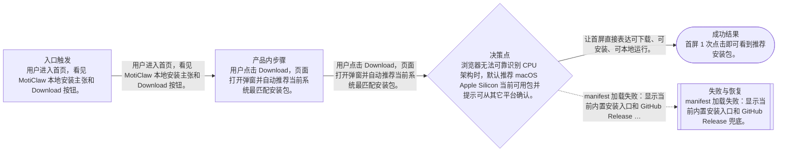
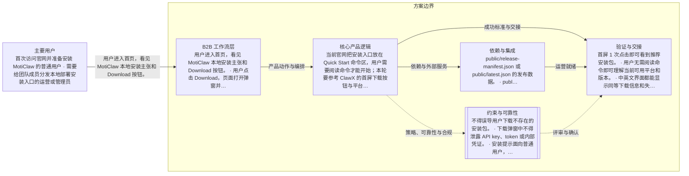

# moticlaw-site homepage install-package download mode
> 语言规则：除 PRD、OpenPrd、OpenSpec、API、SDK、CLI、TypeScript、JSON、HTTP、WebSocket、字段 key、命令名、产品名和协议名等必要专有名词外，用户可见内容应使用简体中文。
- 版本: v0001
- 负责人: 超级峰 / Codex
- 产品类型: b2b
- 模板包: b2b
- 状态: synthesized
- 生成时间: 2026-05-06 21:55:01
## 元信息

- 标题: moticlaw-site homepage install-package download mode
- 负责人: 超级峰 / Codex
- 状态: draft
- 版本: v0001
- 产品类型: b2b
- 日期: 2026-05-06

## 问题

- 问题陈述: 当前官网把安装入口放在 Quick Start 命令区，用户需要阅读命令才能开始；本轮要参考 ClawX 的首屏下载按钮与平台选择弹窗，把官网改成更直接的安装包下载模式。
- 为什么是现在: 项目的 release-manifest/latest.json 已经存在 v0.1.2 macOS Apple Silicon 安装包信息，官网也已经临时改成单平台一键安装文案，适合把安装入口从命令复制升级为下载转化入口。
- 证据:
  - Computer Use 调研 ClawX：首屏主按钮为 Download Now，点击后弹出 Download ClawX v0.4.0，显示发布日期、自动识别系统、推荐安装包和其它平台列表。
  - 本地 public/release-manifest.json 与 public/latest.json 当前包含 v0.1.2 darwin-arm64 artifact、sha256、size_bytes 和 GitHub Release URL。
  - 本地 src/components/moticlaw-landing.tsx 当前首页 CTA 指向 #quick-start，Quick Start 区展示 curl 安装命令。

## 用户与相关方

- 主要用户:
  - 首次访问官网并准备安装 MotiClaw 的普通用户
  - 需要给团队成员分发本地部署安装入口的运营或管理员
- 次要用户:
  - 查看版本更新和校验信息的开发者
  - 从 GitHub Release 或脚本安装迁移过来的存量用户
- 相关方:
  - MotiClaw 产品负责人
  - 官网维护者
  - Release 打包与发布维护者

## 目标与成功标准

- 目标:
  - 让首屏直接表达可下载、可安装、可本地运行。
  - 把主要 CTA 从跳转 Quick Start 改为打开下载弹窗。
  - 在弹窗中给用户一个默认推荐安装包，并保留脚本安装和 GitHub Release 兜底入口。
- 成功指标:
  - 首屏 1 次点击即可看到推荐安装包。
  - 用户无需阅读命令即可理解当前可用平台和版本。
  - 中英文界面都能显示同等下载信息和失败兜底路径。
- 验收目标:
  - 首页主按钮和导航 CTA 打开下载弹窗。
  - 弹窗显示版本号、发布日期、检测到的系统、推荐下载卡片、其它平台区域、安装提示和兜底链接。
  - 当前只有 darwin-arm64 包可用时，其它平台显示即将开放或不可用状态，不误导用户下载不存在的安装包。

## 范围与非目标

- 范围内:
  - 首页首屏文案与 CTA 调整。
  - 下载弹窗交互和响应式视觉设计。
  - 从 release-manifest/latest.json 映射当前可用安装包。
  - 中英文产品文案同步。
  - 两张视觉稿：首页改版方向和下载弹窗状态。
- 范围外:
  - 重新设计完整官网全部内容。
  - 新增真实不存在的平台安装包。
  - 改动 release 打包流水线或 GitHub Release 发布流程。
  - 执行 PRD freeze、handoff 或正式上线发布。

## 场景与流程

- 主流程:
  - 用户进入首页，看见 MotiClaw 本地安装主张和 Download 按钮。
  - 用户点击 Download，页面打开弹窗并自动推荐当前系统最匹配安装包。
  - 用户点击推荐包下载；若平台暂未支持，则选择一键安装命令、GitHub Release 或等待对应平台开放。
  - 用户关闭弹窗后仍留在首页，可继续查看能力和联系入口。
- 边界情况:
  - 浏览器无法可靠识别 CPU 架构时，默认推荐 macOS Apple Silicon 当前可用包并提示可从其它平台确认。
  - manifest 中只有一个可用 artifact 时，不展示可点击的空平台下载。
  - 下载链接缺失时展示 GitHub Release 兜底，而不是生成无效链接。
  - 移动端弹窗需要可滚动，关闭按钮和主下载按钮始终可见。
- 失败模式:
  - manifest 加载失败：显示当前内置安装入口和 GitHub Release 兜底。
  - 复制命令失败：保留命令可手动选择，不阻断下载入口。
  - 平台暂未发布：按钮禁用并显示即将开放，不把用户带到 404。

## 可视化图表

### 产品流程

### 架构

## 需求

- 功能需求:
  - 新增下载弹窗状态，主 CTA、页头 CTA、Quick Start CTA 统一打开弹窗。
  - 弹窗顶部显示版本、发布日期和检测到的系统。
  - 推荐下载卡优先展示当前可用 artifact，包含平台名、文件名、大小、sha256 摘要和安装提示。
  - 其它平台按 macOS、Windows、Linux 分组，当前无包的平台展示不可用状态。
  - 保留一键安装命令复制能力作为高级/兜底路径。
- 非功能需求:
  - 弹窗和首页在桌面与移动端不溢出、不遮挡关键按钮。
  - 下载链接使用真实 manifest URL，不构造不存在的地址。
  - 所有用户可见文案中英文同步维护。
  - 按钮、关闭、复制命令支持键盘焦点和 Escape 关闭。
- 业务规则:
  - 没有真实发布产物的平台不得显示为可下载。
  - 版本、大小、校验值优先来自 release manifest。
  - 用户界面避免暴露内部实现细节，把脚本安装描述为备用安装方式。

## 约束、依赖与风险

- 技术约束:
  - 项目使用 Next 16 App Router，互动首页组件为 Client Component。
  - 本地 AGENTS.md 要求写代码前阅读 node_modules/next/dist/docs 中对应版本指南。
  - 当前首页主实现位于 src/components/moticlaw-landing.tsx，样式位于 src/app/globals.css。
  - 当前已有 Locale=en/zh 的内联 copy 结构，新增产品文案必须双语同步。
- 合规要求:
  - 不得误导用户下载不存在的安装包。
  - 下载弹窗中不得泄露 API key、token 或内部凭证。
  - 安装提示面向普通用户，避免使用 HTTP 状态码、内部模块名等技术视角文案。
- 依赖:
  - public/release-manifest.json 或 public/latest.json 的发布数据。
  - public/install.sh 与 public/install.ps1 的备用安装脚本。
  - GitHub Release 中真实存在的安装包 URL。
  - @phosphor-icons/react 图标库。
- 假设:
  - 当前可用真实安装包只有 darwin-arm64 v0.1.2。
  - 官网域名 moticlaw.com/install.sh 会继续作为一键安装入口。
  - 用户希望先看到方案和视觉稿，本轮不执行 PRD freeze。
- 风险:
  - 若 UI 展示多平台但 manifest 仍只有单平台，会造成下载失败或信任损耗。
  - 如果下载弹窗过于接近 ClawX 视觉，MotiClaw 品牌辨识度会下降。
  - 当前工作区已有未提交下载数据改动，实施时必须保留并衔接这些改动。
- 开放问题:
  - 是否要在正式实现前补齐 Windows/Linux/macOS Intel 安装包？
  - 弹窗主按钮应该直接下载 tar.gz，还是优先运行安装脚本？
  - 下载模式是否需要增加系统权限/安全设置说明？

## 类型专项模块

- 类型: B2B 专项
- buyer: 需要让团队成员低门槛安装本地 Agent 管理平台的产品/运营负责人。
- user: 准备下载并运行 MotiClaw 的普通用户、运营人员和 Agent 管理员。
- admin: 负责安装、配置、更新和分发安装链接的团队管理员。
- operator: 维护官网、发布包和安装脚本的项目运营者。
- roles: 访客、安装者、团队管理员、Release 维护者、官网维护者。
- asIs: 官网当前通过 Quick Start 区展示 curl 命令，首屏主 CTA 跳转页面内部锚点；下载信息分散在 public manifest、install 脚本和 GitHub Release 链接中。
- toBe: 首页首屏直接提供 Download CTA，点击后在站内弹窗完成系统识别、推荐安装包、其它平台分组、备用安装命令和 Release 兜底。
- permissionMatrix: 访客可查看和下载公开安装包；管理员可复制安装脚本；官网维护者和 Release 维护者负责更新 manifest 与发布产物。
- approvalFlow: 视觉稿和 PRD 由用户确认后进入实现；多平台下载按钮只有对应真实产物存在后才可开放。

## 交接

- 负责人: 超级峰 / Codex
- 下一步: 评审 OpenPRD 草案和两张视觉稿；确认后再进入首页代码实现与视觉验收。
- 目标系统: moticlaw-site Next.js homepage
